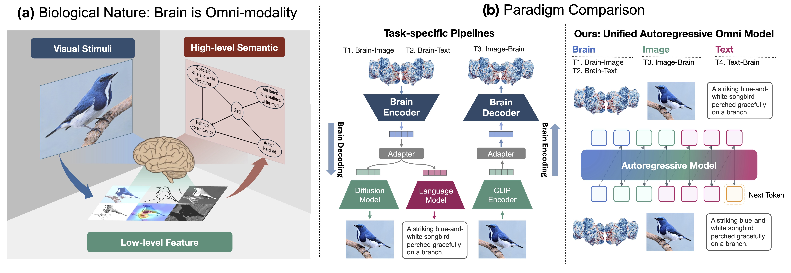

# BrainJanus

## Table of Contents
- [Introduction](#introduction)
- [Repo Architecture](#repo-architecture)
- [Environment Setup](#environment-setup)
- [Data Preparation](#data-preparation)
- [Run](#run)
- [Acknowledgement](#acknowledgement)
- [Citation](#citation)
- [Contact us](#contact-us)

## Introduction 
**This repository is currently under active development. More code, pretrained models, datasets, and documentation will be released progressively.**
This is the official implementation of **BrainJanus: A Foundation Model for Unified Understanding and Generation across Brain, Vision, and Language** (ICML 2026). 

BrainJanus is the first unified brain foundation model that integrates **brain, vision, and language** within a single framework. It introduces:

- **Unified Brain Tokenizer**: a VQ-style tokenizer that quantizes continuous neural dynamics (e.g., fMRI voxels) into discrete tokens aligned with visual and linguistic representations in a shared *Omni* token space.
- **All-in-One Autoregressive Backbone**: built on top of the Janus-Pro family, BrainJanus performs unified next-token prediction over interleaved multimodal sequences, supporting **bidirectional** mapping between brain, image, and text.
- **Four-in-One Multitask Training**: a single model jointly handles four tasks under one objective:
  - Task 0: `fMRI → Image` (visual reconstruction)
  - Task 1: `fMRI → Text` (brain captioning)
  - Task 2: `Image → fMRI` (neural encoding / fMRI synthesis from images)
  - Task 3: `Text → fMRI` (neural encoding / fMRI synthesis from captions)

BrainJanus achieves **SOTA** results on brain-to-text decoding and competitive results on visual reconstruction and visual-to-fMRI synthesis on the Natural Scenes Dataset (NSD).

<p align="center">

</p>

## Repo Architecture
```
BrainJanus/                          # Root directory
├── README.md
├── assets/                          # Paper and figures
│   └── paper.pdf
├── scripts                          # Bash scripts
│   ├── pretrain.sh                  # Pretrain the Unified Brain Tokenizer (fMRI VQ-VAE)
│   └── task.sh                      # Finetune BrainJanus on the 4 unified tasks
└── src                              # Core implementation
    ├── args.py                      # Command-line arguments
    ├── train_final.py               # Main training entry for unified multitask training
    ├── config
    ├── data
    │   ├── dataset.py               # Multi-subject NSD fMRI dataset & multitask sampler
    │   ├── dataset_creation.ipynb   # Notebook for building voxel/image safetensors
    │   ├── eeg.py                   # THINGS-EEG data module
    │   ├── meg.py                   # THINGS-MEG data module
    │   ├── inpating_data.py         # Inpainting / blur data utilities
    │   └── utils.py
    ├── models
    │   ├── brain_omni.py            # BrainJanus: unified brain-vision-language model
    │   ├── janus.py                 # Janus-Pro multimodal backbone wrapper
    │   ├── voxel_vqvae.py           # Unified Brain Tokenizer (VQ-VAE for fMRI voxels)
    │   ├── vq_vae.py                # General VQ-VAE building blocks
    │   ├── rvq.py                   # Residual VQ
    │   ├── ae.py                    # Autoencoder utilities
    │   ├── attention.py             # Attention modules
    │   ├── clip.py                  # CLIP wrapper for visual/textual features
    │   ├── conversation.py          # Conversation/prompt templates
    │   ├── fmri.py                  # fMRI encoder / projection
    │   ├── patch.py                 # Patchify utilities
    │   └── utils.py
    └── third_party
        └── janus                    # Janus-Pro / JanusFlow source (vendor)
```

## Environment Setup
- Python 3.10
- CUDA 12.1
- PyTorch 2.4.1
- Accelerate (DeepSpeed ZeRO-2 / ZeRO-3)
- Transformers, PEFT (LoRA), wandb, safetensors, einops, omegaconf

We recommend using a fresh conda environment:

```bash
conda create -n brainjanus python=3.10 -y
conda activate brainjanus
pip install -r requirements.txt
```

`accelerate` configs for distributed training are provided under `src/config/accelerate_configs/` (DDP, ZeRO-2, ZeRO-2-offload, ZeRO-3, ZeRO-3-offload).

## Data Preparation
We follow MindEye2 / NSD's preprocessing protocol. The main dataset used in the paper is the **Natural Scenes Dataset (NSD)**, where 8 subjects viewed natural images from COCO across ~40 sessions.

The expected directory layout after preparation is:

```
/data
├── voxel/
│   ├── subj01_train_bf16.safetensors
│   ├── subj01_test_avg_bf16.safetensors
│   ├── ...
│   └── subj08_test_avg_bf16.safetensors
├── image/
│   └── nsd_stimuli_384_uint8.safetensors
└── captions/
    └── ...                # COCO captions associated with NSD stimuli
```

Notes:
- Voxel files are stored in `bf16` `safetensors` format, one file per subject for train (`_train_bf16` or `_train_avg_bf16`) and one for test (`_test_avg_bf16`).
- Images are stored as a single `safetensors` file at 384×384 (`uint8`).
- During training, data is `rsync`'d to `/dev/shm/data` for fast in-memory access (see `scripts/task.sh` and `scripts/pretrain.sh`).

The dataset construction can be reproduced from raw NSD using `src/data/dataset_creation.ipynb`.

For EEG / MEG experiments referenced in the paper, the THINGS-EEG and THINGS-MEG datasets are used. The corresponding data modules are in `src/data/eeg.py` and `src/data/meg.py`.

## Run

The pipeline has two stages: (1) pretrain the **Unified Brain Tokenizer** on fMRI voxels, and (2) finetune **BrainJanus** with the unified All-in-One autoregressive objective.

### 1. Pretrain the Unified Brain Tokenizer
Pretrain the fMRI VQ-VAE across all 8 NSD subjects. The script sweeps over codebook sizes (default 256):

```bash
/bin/bash scripts/pretrain.sh
```

Key arguments (see `src/args.py`):
- `--codebook_size`  codebook size of the brain tokenizer (e.g., 64 / 128 / 256 / 512 / 1024)
- `--subj_list`      list of subjects, e.g., `"[1,2,3,4,5,6,7,8]"`
- `--epoch`          number of pretraining epochs
- `--batch_size` / `--test_batch_size`

This produces a checkpoint such as `checkpoints/Pretrain_fMRI_codebook256/epoch_xxx`.

### 2. Finetune BrainJanus (unified multitask training)
After pretraining, set `CKPT` in `scripts/task.sh` to the pretrained tokenizer checkpoint, then run:

```bash
/bin/bash scripts/task.sh
```

`scripts/task.sh` supports both **single-task** training and **mixed multitask** training:

```bash
# Single-task examples
# task 0: fMRI → Image
accelerate launch --config_file=config/accelerate_configs/zero2.yaml --num_processes 8 \
    train_final.py --task 0 --name $name --subj_list "[1]" \
    --epoch 30 --batch_size=32 --test_batch_size=64 \
    --train_tag $train_tag --test_tag $test_tag

# task 1: fMRI → Text (cross-subject, all 8 subjects)
accelerate launch ... --task 1 --subj_list "[1,2,3,4,5,6,7,8]" --epoch 30 ...

# task 2: Image → fMRI
accelerate launch ... --task 2 --subj_list "[1,2,5,7]" --epoch 15 ...

# task 3: Text → fMRI
accelerate launch ... --task 3 --subj_list "[1]" --epoch 15 ...

# Mixed multitask training (no --task arg → samples task ∈ {0,1,2,3} per batch)
accelerate launch --config_file=config/accelerate_configs/zero2.yaml --num_processes 8 \
    train_final.py --name $name --subj_list "[1]" --epoch 30 \
    --batch_size=32 --test_batch_size=64 \
    --train_tag $train_tag --test_tag $test_tag
```

Important arguments (see `src/args.py`):
- `--task`            `0` fmri2image, `1` fmri2text, `2` image2fmri, `3` text2fmri; omit for mixed multitask
- `--name`            run name (used for checkpoint saving and W&B logging)
- `--subj_list`       JSON list of NSD subjects to train on (single or multi-subject)
- `--config`          path to model config (`src/config/*.yaml`)
- `--model_type`      base multimodal backbone, default `models/Janus-Pro-7B`
- `--train_tag` / `--test_tag`  voxel file suffix (e.g., `_train_avg_bf16`, `_test_avg_bf16`)
- `--multisubject_ckpt`         path to a pre-trained multisubject checkpoint to finetune from
- `--epoch`, `--batch_size`, `--test_batch_size`, `--max_lr`, `--lr_scheduler_type`

### 3. Evaluate and plot metrics

```bash
python plot/compute_plot_metric.py --name $name
```

This computes brain-to-image and brain-to-text decoding metrics (low-level, high-level, retrieval, BERTScore, CLIP score) and the visual-to-fMRI synthesis metrics reported in the paper.

## Acknowledgement
We acknowledge the contributions of the following datasets:
- [A massive 7T fMRI dataset to bridge cognitive neuroscience and artificial intelligence](https://www.nature.com/articles/s41593-021-00962-x) [Natural Scenes Dataset (NSD)]
- [A large and rich EEG dataset for modeling human visual object recognition](https://www.sciencedirect.com/science/article/pii/S1053811922008758) [THINGS-EEG]
- [THINGS-data, a multimodal collection of large-scale datasets for investigating object representations in human brain and behavior](https://pubmed.ncbi.nlm.nih.gov/36847339/) [THINGS-MEG]

The code is inspired by prior awesome works on neural decoding/encoding and unified multimodal modeling:
- [MindEye2: Shared-Subject Models Enable fMRI-To-Image With 1 Hour of Data](https://github.com/MedARC-AI/MindEyeV2) [ICML 2024]
- [UMBRAE: Unified Multimodal Brain Decoding](https://github.com/weihaox/UMBRAE) [ECCV 2024]
- [MindLLM: A Subject-Agnostic and Versatile Model for fMRI-to-Text Decoding](https://github.com/weijian-mai/MindLLM) [ICML 2025]
- [SynBrain: Enhancing Visual-to-fMRI Synthesis via Probabilistic Representation Learning](https://github.com/weijian-mai/SynBrain) [2025]
- [MindSimulator: Exploring Brain Concept Localization via Synthetic fMRI](https://github.com/CocoonStaceyBao/MindSimulator) [2025]
- [Bridging the Vision-Brain Gap with an Uncertainty-Aware Blur Prior (UBP)](https://github.com/HaitaoWuTJU/UBP) [CVPR 2025]
- [Janus-Pro: Unified Multimodal Understanding and Generation](https://github.com/deepseek-ai/Janus) [DeepSeek-AI, 2025]

## Citation
If you find our work helpful, please cite:
```bibtex
@inproceedings{wu2026brainjanus,
  title={BrainJanus: A Unified Model for Understanding and Generation across Brain, Vision, and Language},
  author={Wu, Haitao and Zhang, Qirui and Yao, Zhouheng and Sun, Shangquan and Zheng, Qihao and Liu, Mianxin and Zhang, Chi and Ouyang, Wanli and Song, Chunfeng and Zhang, Changqing and Wu, Jiamin},
  booktitle={Proceedings of the International Conference on Machine Learning (ICML)},
  year={2026}
}
```

## Contact us
For any additional questions, feel free to email wuhaitao@tju.edu.cn .
